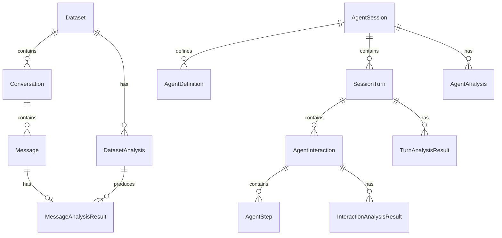
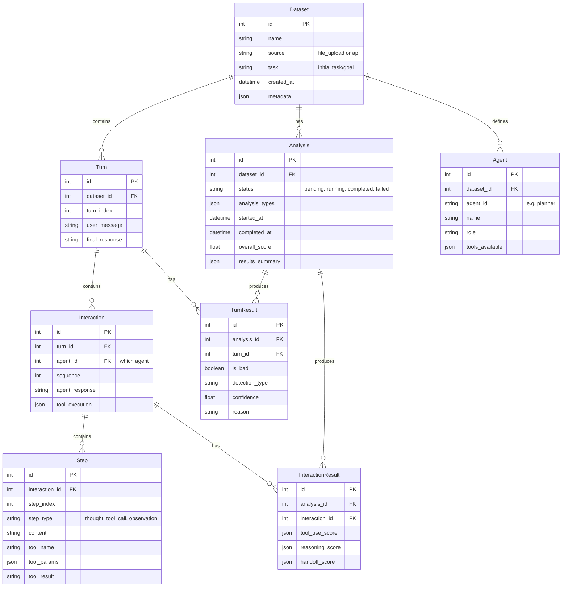

# Database Schema Refactor - From Chaos to Clean

## Problem Statement

The current database schema has major issues:

1. **Confusing naming**: `Message`, `MessageAnalysisResult`, `InteractionAnalysisResult` - what does any of this mean?
2. **Empty/unused tables**: `datasets`, `dataset_analyses`, `conversations` are empty because the FE sends data directly to the agent evaluation endpoints
3. **Two disconnected flows**:
   - **Dataset flow** (file upload): `Dataset` → `Conversation` → `Message` → `MessageAnalysisResult`
   - **Agent flow** (API payload): `AgentSession` → `SessionTurn` → `AgentInteraction` → `AgentStep` + various analysis results
4. **No unified concept**: No clear "Dataset → Analysis" relationship

## User Review Required

> [!IMPORTANT]
> Before I implement, please confirm:
> 1. Do you want to **merge** the two flows into one? (FE sends data → stored as Dataset → analyze)
> 2. Or do you want to **keep them separate** but clean up naming?
> 3. What's the primary use case - file uploads (CSV/JSON) or direct API payloads?

---

## Current Schema (The Mess)



---

## Proposed New Schema (Clean & Simple)

The key insight: **Everything is a Dataset. Analysis runs on Datasets.**



---

## Proposed Changes

### Backend (`api/database.py`)

#### [DELETE] Old tables to remove:
- `Conversation` - merged into Turn concept
- `Message` - too specific to file upload, replaced by Turn/Interaction
- `MessageAnalysisResult` - replaced by unified TurnResult
- `DatasetAnalysis` - merged into Analysis

#### [MODIFY] Tables to rename/simplify:
| Old Name | New Name | Notes |
|----------|----------|-------|
| `AgentSession` | `Dataset` | The core data container |
| `AgentDefinition` | `Agent` | Simpler name |
| `SessionTurn` | `Turn` | Simpler name |
| `AgentInteraction` | `Interaction` | Simpler name |
| `AgentStep` | `Step` | Simpler name |
| `AgentAnalysis` | `Analysis` | Simpler name |
| `TurnAnalysisResult` | `TurnResult` | Simpler name |
| `InteractionAnalysisResult` | `InteractionResult` | Simpler name |

#### [MODIFY] [database.py](file:///Users/julienwuthrich/GitHub/ReAsk/api/database.py)
- Rename all models as shown above
- Add `source` field to Dataset ("file_upload" | "api_payload")
- Consolidate the two flows into one

---

### Backend Routes

#### [DELETE] [datasets.py](file:///Users/julienwuthrich/GitHub/ReAsk/api/routes/datasets.py)
- Remove the separate file upload flow
- Or: Keep but make it create a `Dataset` in the new unified schema

#### [MODIFY] [agent_eval.py](file:///Users/julienwuthrich/GitHub/ReAsk/api/routes/agent_eval.py)
- Update all references to use new model names
- Simplify the API surface

---

### Frontend

#### [MODIFY] `web/app/agent/page.tsx`
- Update API types to match new schema
- Update any references to old field names

#### [MODIFY] `web/lib/api.ts` (if accessible)
- Update type definitions
- Update API endpoints

---

## Verification Plan

### Manual Testing
1. Start the backend: `cd api && uvicorn main:app --reload`
2. Start the frontend: `cd web && npm run dev`
3. Test the following flows:
   - Load an example trace in the Agent page
   - Run analysis on it
   - Verify the data is stored correctly in SQLite
   - Check that results display properly

### Database Verification
```bash
sqlite3 reask_data.db "SELECT name FROM sqlite_master WHERE type='table';"
```
Should show the new simplified table names.

---

## Questions for You

1. **Do you want me to keep the file upload feature?** (CSV/JSON → Dataset)
2. **Should I create a migration script** for any existing data, or start fresh?
3. **Any specific naming preferences** for the new tables?
